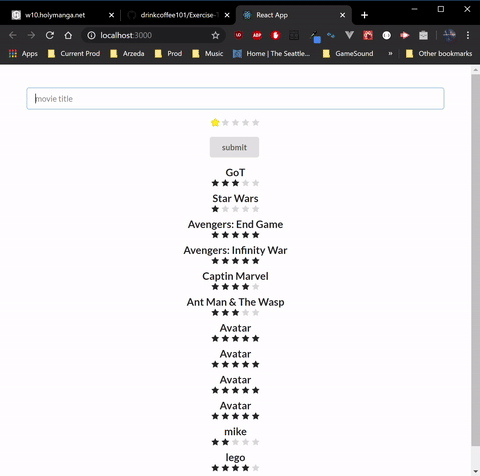

# Exercise Tracker
This app was built following a tutorial video by [Pretty Printed](https://www.youtube.com/watch?v=Urx8Kj00zsI) (flask portion) and [Ben Awad](https://www.youtube.com/watch?v=06pWsB_hoD4) (react portion)

### Technologies Used
#### Back-end
* Flask
* SQLite3
* SQLAlchemy
* cors

#### Front-End
* React
* Semantic-UI

## Current Issues
* None 

### Snapshots

